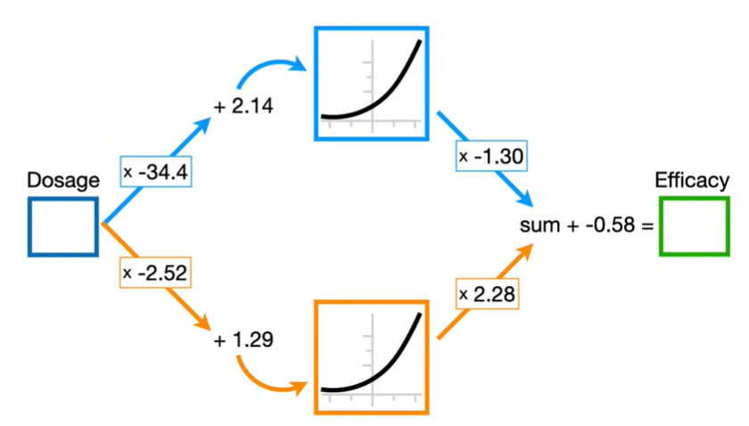
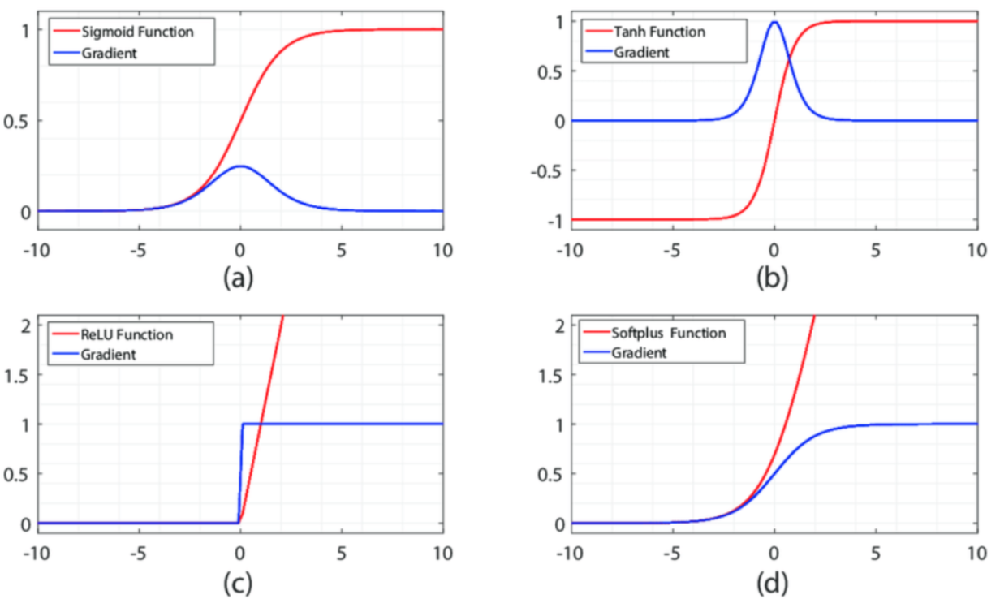
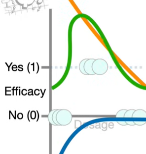

# Redes Neurais Parte 1: Dentro da Caixa Preta

## Definição de uma Rede Neural

Uma rede neural consiste de nós e conexões entre os nós. Os números entre cada conexão representam parâmetros que foram estimados quando essa rede neural foi ajustada para os dados.

A rede neural começa com valores desconhecidos de parâmetros, que são estimados quando se treina a rede neural à um dataset usando um método chamada Backpropagation.

Percebe-se na imagem que alguns nós possuem linhas curvas dentro deles, eles são os blocos de construção para ajustar a curva aos dados. Essas curvas podem ser transformadas pelos parâmetros e somadas juntas para alcançar a curva que se ajusta aos dados.

Essa linha curva em específico se chamam **softplus**, porém também temos a **ReLu** que é uma abreviação para **Rectified Linear Unit**, como também temos a **sigmoid**. Essas linhas curvas ou dobradas são chamadas de função de ativação. Quando se constrói uma rede neural é necessário decidir qual função de ativação utilizar.

As equações das curvas são dadas a seguir:

$$
\sigma(x) = \frac{1}{1 + e^{-x}}
$$

$$
\text{ReLU}(x) =
\begin{cases}
0, & x < 0 \\
x, & x \ge 0
\end{cases}
$$

$$
\text{Softplus}(x) = \ln(1 + e^x)
$$

$$
\tanh(x) = \frac{e^x - e^{-x}}{e^x + e^{-x}}
$$

**Camadas escondidas:** Camadas de nós entre os nós de entrada e os nós de saída.

## Criando uma curva a partir das funções de ativação

Para calcular a saída de um neurônio, a entrada é multiplicada pelo peso da conexão e somada ao viés. Encontrando um valor z

Esse valor z é utilizado como entrada da função de ativação. A função de ativação recebe z como coordenada no eixo x e retorna um valor correspondente no eixo y, produzindo a saída do neurônio.

Repetindo esse processo para vários valores de entrada, é possível traçar a curva gerada pelo neurônio. Em redes neurais com múltiplos neurônios, cada um produz sua própria curva de ativação. Essas curvas são então escaladas por seus respectivos pesos na camada seguinte e combinadas por meio de somas, formando curvas mais complexas, que se ajustamo ao padrão dos dados.

A imagem mostra duas curvas criadas a partir de cada neurônio (laranja e azul), quando somadas e multiplicadas pela escala, se ajustam ao dados, as curvas foram feitas a partir da rede neural acima, com valores de entradas de 0 a 1, buscando se ajustar aos dados que são representados por pequenos círculos na imagem.

Lição da aula: Redes Neurais deveriam se chamar **Big Fancy Squiggle Fitting Machines.**

