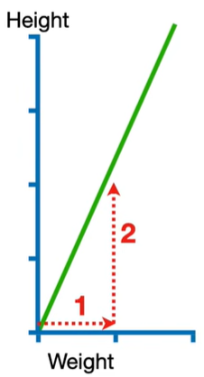
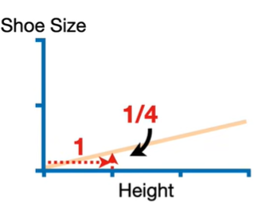

# A regra da cadeia

Começando por uma revisão de derivadas:

Ao calcular a derivada de uma função $f(x)$, econtra-se uma função que determina a inclinação da reta tangente em cada ponto $x$ da função original, então para um ponto $x_0$ temos:

$m = f'(x_0)$

Equação da reta:

$y - y_0 = m(x-x_0)$  
$y - f(x_0) = f'(x_0)(x-x_0)$

Considerando o exemplo de uma função quadrática:

$f(x) = x^2$

$f'(x) = 2x$

então para um valor $x_0 = 3$ temos que:

$f(x_0) = 9$

$f'(x_0) = 6$

A equação da reta tangente ao ponto $(3, 9)$ então será:

$y - 9 = 6x - 18$  
$y = 6x - 9$

## Exemplo regra da cadeia

Um gráfico de Altura x Peso, no qual para cada peso temos um aumento de 2 em altura.

Um gráfico de Tamanho pé x Altura, no qual para cada altura temos aumento de 1/4 em Tamanho do pé.

Dessa forma conseguimos econtrar a partir da inclinação da reta:

$\frac{d(Altura)}{d(Peso)} = \frac{2}{1} = 2$ 

$\frac{d(\text{Tamnaho Pé})}{d(Altura)} = \frac{1/4}{1} = 1/4$

Com isso as equações das retas ficam:

$Altura =  \frac{d(Altura)}{d(Peso)} \times Peso = 2 \times Peso$

$\text{Tamanho pé} =  \frac{d(\text{Tamanho pé})}{d(Altura)} \times Altura = 1/4 \times Altura$

Portanto dessa maneira conseguimos por transitividade calcular o Tamanho do pé com base no Peso:

$\text{Tamanho pé} =  \frac{d(\text{Tamanho pé})}{d(Altura)} \times \frac{d(Altura)}{d(Peso)} \times Peso = 1/2 \times Peso$

Vemos então que:

$\frac{\text{d(Tamanho pé)}}{\text{d(Peso)}} = \frac{d(\text{Tamanho pé})}{d(Altura)} \times \frac{d(Altura)}{d(Peso)}$

A Regra da cadeia pode ser aplicada para minimizar o Erro residual ao quadrado, uma função utilizada como métrica em Aprendizado de Máquina.

